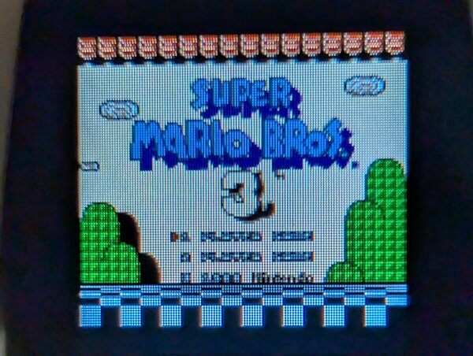
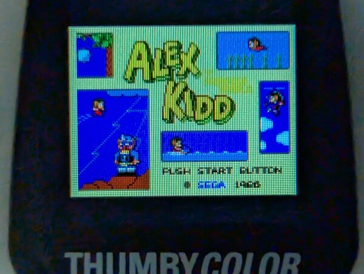
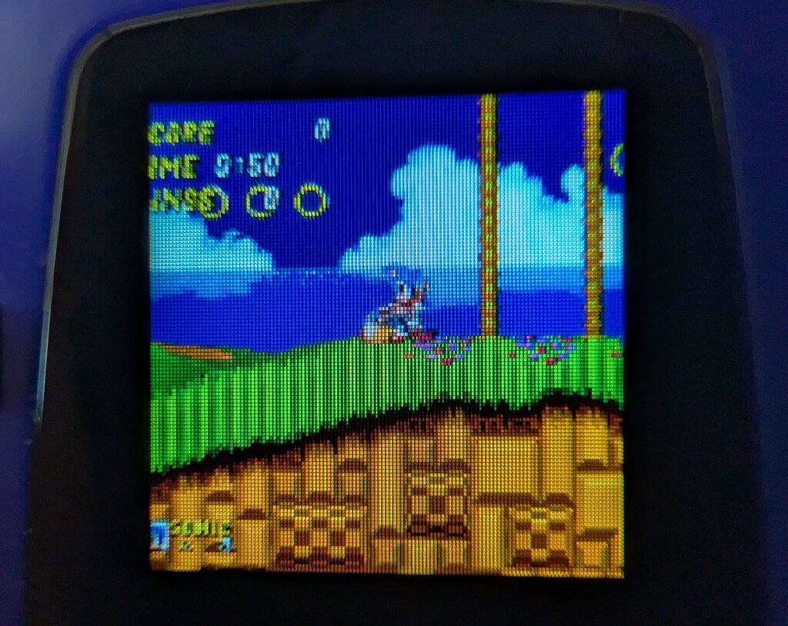
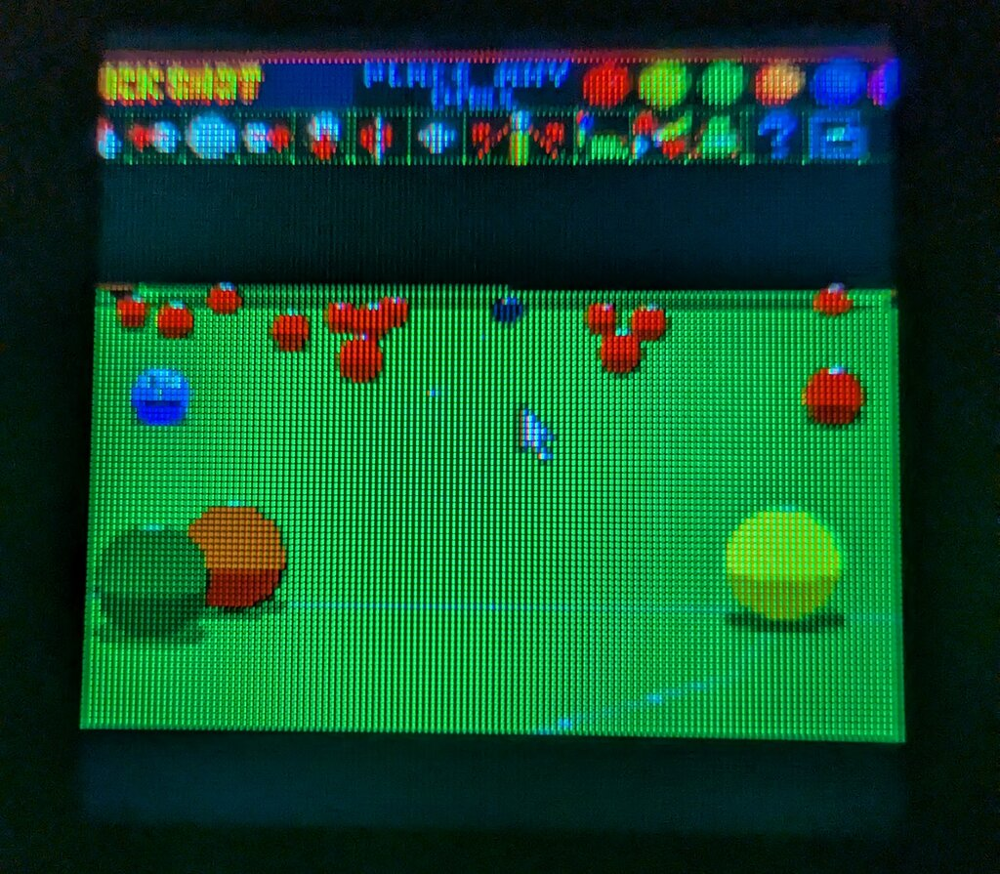
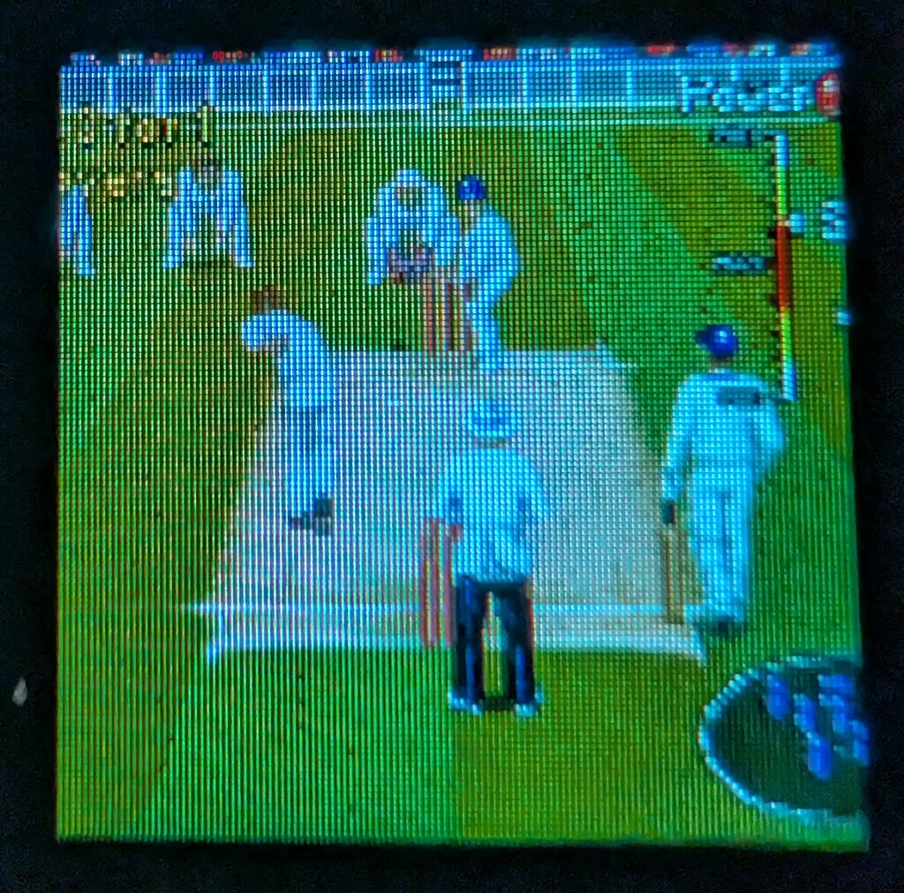
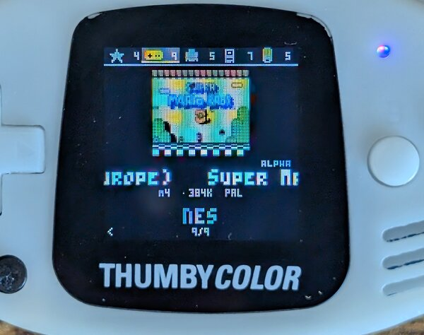
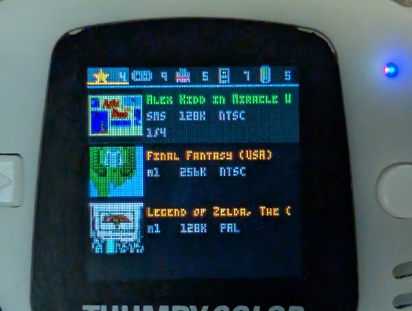
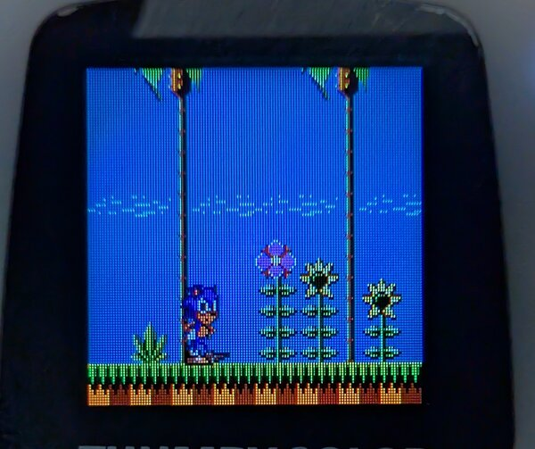

# ThumbyNES

> 🎮 **ThumbyNES is now part of [ThumbyOne](https://github.com/austinio7116/ThumbyOne)** — a unified multi-boot firmware that ships ThumbyNES, ThumbyP8 (PICO-8), ThumbyDOOM, and MicroPython + Tiny Game Engine in a single UF2 with one shared USB drive for ROMs, carts, and Python games. Most users should flash ThumbyOne instead of the standalone ThumbyNES firmware below.
>
> This repo remains the standalone build of ThumbyNES and the source of truth for the emulator itself — the code here is what ThumbyOne's NES slot compiles. Use this repo if you specifically want NES-only firmware, or to hack on the emulator code.

A bare-metal **NES + Sega Master System + Game Gear + Game Boy (DMG + Color)
+ Sega Mega Drive / Genesis + PC Engine / TurboGrafx-16 (HuCard)** emulator
firmware for the **TinyCircuits Thumby Color** (RP2350, 128×128 RGB565 LCD,
PWM audio, 520 KB SRAM, 16 MB flash).

Drop `.nes`, `.sms`, `.gg`, `.gb`, `.gbc`, `.md`, `.gen`, `.bin`, or `.pce`
ROMs onto the device over USB, browse them in a tabbed picker with thumbnail
screenshots, play with sound. Per-ROM saves and **save states**, per-ROM and global
settings, in-game pause menu, idle sleep, fast-forward, palettes,
in-game screenshot capture, live-pan read mode for the handhelds,
**cluster-level FAT defragmenter with live cluster map**,
**chained-XIP fallback** so fragmented carts still load at full
speed, configurable system clock — all in a single ~1.2 MB
firmware image.

<p align="center">


</p>
<p align="center">


</p>
<p align="center">



</p>

<!-- TODO: PCE shot row — capture from device once 1.08 is flashed -->

[`firmware/nesrun_device.uf2`](firmware/nesrun_device.uf2) is committed
to the repo if you want to flash without setting up the toolchain.

---

## Quickstart

1. **Flash the firmware.** Power off the Thumby Color, hold the
   **DOWN** d-pad, power back on. The device mounts as `RPI-RP2350`.
   Drag `firmware/nesrun_device.uf2` onto it. The device auto-reboots
   into ThumbyNES.

2. **First boot** wipes the disk to a fresh FAT16 volume labelled
   `THUMBYNES` (a yellow splash flashes briefly).

3. **Drop ROMs.** Plug the device into a host. It enumerates as a
   removable drive — copy any number of `.nes`, `.sms`, `.gg`, `.gb`,
   `.gbc`, `.md`, `.gen`, `.bin`, or `.pce` files into the root. Eject
   from the host. The device flushes the cache and the picker rescans.

4. **Pick + play.** Browse with the **D-pad**, shoulder buttons
   switch tabs, **A** to launch.

5. **Hold MENU at boot** to force-reformat the FAT volume (only takes
   effect if the volume can't otherwise be mounted).

6. **Hold B at boot** to force the FAT defragmenter to run (normally
   it auto-runs only when needed).

---

## The picker

The browser is the resting state of the device — there's no separate
"main menu". When you exit a game (Quit from the in-game menu) you
land back here. Pressing MENU in the picker opens the **picker menu**
overlay; the picker itself only ever exits via launching a ROM.

### Layout: tabs + two views

A **tab strip** runs across the top of the picker:

```
[★ FAV] [NES] [SMS] [GB] [GG] [MD] [PCE]
```

Each tab shows a hand-painted 12×8 platform icon (NES controller,
SMS cartridge, Game Boy silhouette, GG pill, MD pad, PCE HuCard,
star for favorites) and the ROM count for that tab. Active tabs are
highlighted in orange; inactive tabs in grey (with a slightly darker
grey on SMS / MD where the bigger silhouettes would otherwise visually
dominate the strip). Empty tabs are skipped automatically when stepping
with the shoulder buttons.

Two views, swapped from the picker menu (`Display: HERO / LIST`):

<p align="center">


</p>

- **Hero view** (default) — one ROM per screen, 64×64 thumbnail
  centred under the tab strip, large 2×-scaled ROM title (auto-marquees
  if it doesn't fit), small dim meta line, **the active tab name in
  the larger 2× font** (`NES`, `MASTER SYSTEM`, `GAME BOY`, `GAME GEAR`,
  `FAVORITES`), favorite indication via yellow title text, sort badge
  in the title row, position counter with prev/next arrows along the
  very bottom.
- **List view** — three rows per screen, each row a 32×32 thumbnail
  next to the ROM name and meta. Highlighted row glows green; the
  selected row's position-in-tab appears as a third line.

The thumbnails are screenshots you've captured in-game (see below).
ROMs without a screenshot fall back to a placeholder: the same
hand-painted platform icon nearest-neighbour upscaled to 24×16
(list view) or 48×32 (hero view) inside a tinted panel.

### Picker controls

| Key | Action |
|---|---|
| **LEFT / RIGHT / UP / DOWN** | prev / next ROM (any D-pad direction; wraps at both ends) |
| **LB / RB** | prev / next tab (skips empty tabs) |
| **A** | launch the highlighted ROM |
| **B tap** (< 300 ms) | toggle favorite (highlighted ROM goes yellow) |
| **B hold** (≥ 5 s) | red `DELETE ROM?` confirmation overlay with countdown |
| **B hold** (≥ 10 s) | actually delete the ROM + all its sidecars |
| **MENU tap** | open the **picker menu** |

The picker is the resting state — there is no exit-to-lobby chord.
Once a ROM is on disk you stay in the picker until you launch
something.

### Picker menu

Tap **MENU** in the picker to open a full-screen overlay listing
system-wide settings, current device status, and one-shot actions:

<p align="center">

</p>

| Item | Kind | Notes |
|---|---|---|
| Resume | Action | close the overlay |
| Volume | Slider 0..30 | global master volume — see [Audio](#audio) below |
| Overclock | Choice | global system clock: 125 / 150 / 200 / 250 MHz, takes effect on next launch |
| Display | Choice HERO / LIST | swaps the picker layout |
| Sort | Choice ALPHA / FAVS / SIZE | favs-first puts your starred carts on top, size sorts descending |
| Battery | Info row | live percent + voltage; flips to `CHRG` when external power is detected; bar strip shows level |
| Storage | Info row | `<used>.<dec>/<total>.<dec> MB`; bar strip shows used fraction |
| Defragment now | Action | manual trigger of the same FAT defragmenter that runs at boot |
| About | Info row | firmware identifier |

D-pad UP/DOWN walks the items, LEFT/RIGHT changes values for
sliders / choices, A activates Action items, B or MENU closes the
menu without further action. The frozen picker frame stays visible
behind a darkened overlay so you have context.

### Per-tab selection memory

The picker remembers which ROM you had highlighted on every tab.
Switching tabs preserves the highlight on the tab you left and
restores the highlight on the tab you arrive at. Launching a ROM
also remembers the same selection so when you exit the game you
come back to the cart you just played, in the tab you launched it
from. Persisted across reboots in `/.picker_view`.

### Deleting ROMs in the picker

Holding **B** on the highlighted ROM is the explicit-confirmation
delete path: short taps still toggle the favorite, and you have to
sit on the button for a full 10 seconds for anything to actually
happen.

- **0 .. 300 ms** — released here → toggle favorite (no overlay).
- **300 ms .. 5 s** — released here → cancelled, no effect.
- **5 s mark** — a full-screen red `DELETE ROM?` overlay drops in
  with a `release B to cancel` hint and a `in N` countdown updated
  every frame. Releasing B at any point before the 10 s mark aborts
  with no side effects.
- **10 s mark** — the highlighted ROM file is unlinked along with
  its `.sav`, `.cfg`, `.scr32`, `.scr64` and `.sta` sidecars; the
  favorite entry is removed if present; the picker re-scans the
  volume, reseats the selection on the closest surviving entry, and
  flashes a brief `deleted` OSD. Deleting the last ROM bounces the
  picker back to the lobby's no-roms splash.

### Live USB rescan

The picker watches USB MSC activity and rescans the FAT volume
whenever host writes go quiet for ≥ 400 ms. Files added or deleted
via the host filesystem appear / disappear without having to reboot
the device — including the per-tab count badges, the active selection
if it points at a now-deleted entry, and the no-roms splash fallback
when the volume is emptied.

### Persistence

| File | Purpose |
|---|---|
| `/.picker_view` | Active view, tab, sort mode, **plus the per-tab last-selected ROM names**. |
| `/.global` | Global master volume + global overclock value. Changed from any in-game menu or the picker menu. |
| `/.favs` | Plain newline-separated list of favorited base ROM names (system-agnostic). Survives reboots, editable from a host over USB. |

### Long filenames

The picker stores up to **96-character** ROM names so full no-intro
/ GoodNES tags like `Super Mario Land 2 - 6 Golden Coins (USA, Europe).gb`
fit without truncation. The path buffers in every runner are sized
for `name + 16` so the leading `/` and any sidecar suffix
(`.scr32`, `.scr64`, `.cfg`, `.sav`, `.sta`) round-trip intact.

---

## Controls in-game

### Cart inputs

| Thumby button | NES | SMS | Game Gear | Game Boy | Mega Drive / Genesis | PC Engine |
|---|---|---|---|---|---|---|
| **A** (right face) | A | Button 2 | Button 2 | A | B (jump/light attack) | I |
| **B** (left face)  | B | Button 1 | Button 1 | B | A | II |
| **D-pad**          | D-pad | D-pad | D-pad | D-pad | D-pad | D-pad |
| **LB**             | Select | — | — | Select | **Start** | **Select** |
| **RB**             | Start | Pause | Start | Start | C (heavy attack) | Run |

MD's **Start** and PCE's **Select** are both on **LB** — but on
those two cores LB fires on RELEASE (a tap, not the press) so that
holding LB can engage the [CROP pan chord](#pan-chord-lb--d-pad)
below without spuriously hitting the cart input. Held LB still
works for "press START to continue" / "Select to cycle weapon"
prompts via the release pulse, and tap-dismiss of level-clear
screens behaves as expected. MENU tap is reserved for scale-mode
cycling (FIT / FILL / CROP — or FIT / CROP on PCE). MENU+A still
saves a screenshot, and MENU long-hold opens the in-game menu. On
MD, the 6-button sub-mode (X/Y/Z/MODE) stays available via the
in-game toggle for any future rebind; by default it stays off and
those bits are stripped so carts read a plain 3-button pad.

### MENU chords during play

The in-game chord set is now small — most settings live in the
in-game menu (open with MENU long-hold) instead.

| Gesture | Action |
|---|---|
| **MENU tap** (< 300 ms, no chord) | Toggle FIT ↔ CROP scaling |
| **MENU long hold** (≥ 500 ms, no chord) | Open the **in-game menu** |
| **MENU + A** | Save a screenshot (32×32 + 64×64 sidecars) |
| **MENU + dpad** *(GG / GB only)* | Pan the live CROP viewport while the cart keeps running |

### Pan chord (LB + d-pad)

On **MD** (CROP and FILL) and **PCE** (CROP), **hold LB and press a
d-pad direction** to pan the source viewport while the cart keeps
running. MD CROP gets full XY pan inside the native 320×224 / 256×224
frame; MD FILL gets left/right pan within the centre crop (Y always
fills the screen); PCE CROP gets full XY pan inside the native
256×224 frame. Pan offsets persist across pan sessions until the
cart unloads.

While the chord is active:

- The cart sees no d-pad input — the d-pad is yours, for panning.
- LB → cart-input (MD START / PCE SELECT) is suppressed so the game
  never sees a press during a pan move.
- Face buttons (A, B, RB) still reach the cart, so action games keep
  responding to the rest of the input. Useful for "see the HUD
  off-screen / dialog box / map / minimap" while you keep jumping
  or punching.

On release of LB:

- If no pan motion happened during the hold, the LB-bound input
  pulses to the cart for a few frames so a "tap LB" still acts
  normally — Start on MD, Select on PCE. (This is what lets LB
  feel like a normal cart button when you're not panning.)
- If you panned during the hold, the pulse is swallowed so chord
  exit doesn't accidentally fire the cart input.

### At boot

| Gesture | Action |
|---|---|
| **MENU held** | Force a FAT reformat if the volume can't be mounted. |
| **B held**    | Force the FAT defragmenter pass even if the pre-flight thinks nothing's fragmented. |

---

## In-game menu

Hold MENU for ≥ 500 ms to open the in-game menu in any runner. The
cart freezes, audio stops, and the menu draws over a darkened copy
of the last frame. Items vary slightly per system but the core set
is shared:

| Item | Available on | Notes |
|---|---|---|
| Resume | all | close the menu, unfreeze the cart |
| Save state | all | write `<rom>.sta` next to the ROM |
| Load state | all (greyed when no `.sta`) | restore from `<rom>.sta` |
| Display | all | FIT ↔ CROP — the same toggle as the MENU short tap |
| Volume | all | Slider 0..30 — **global** value, also in the picker menu |
| Fast-fwd | all | toggle 4× speed |
| Show FPS | all | toggle the on-screen FPS overlay |
| BLEND | NES, SMS | toggle 2×2 box-average smoothing |
| Palette | NES (6 choices), GB (6 choices) | per-cart |
| Region | NES | NTSC ↔ PAL — takes effect on the next launch |
| Overclock | all | per-cart override: `global` or 125/150/200/250 MHz, takes effect on the next launch |
| Quit to picker | all | exit the cart |

The menu controls (inside the overlay):

| Key | Action |
|---|---|
| **UP / DOWN** | Move cursor (skips disabled and Info rows) |
| **LEFT / RIGHT** | Adjust slider / choice / toggle value |
| **A** | Activate Action items, also toggles bool items |
| **B** or **MENU** | Close menu without further action |

Volume changes write directly to `/.global` so the new value is
immediately visible across runners and to the picker menu. Overclock
changes write to the cart's `.cfg` (the per-cart override) and take
effect on the **next launch** of any cart — the runner doesn't
reinit the system clock mid-cart because audio and LCD timing are
configured against it.

---

## Audio

The PWM driver runs at 22050 Hz, 9-bit. The runners apply software
volume scaling per-frame:

- `volume == 0` → silence
- `volume == 15` (default) → unity passthrough
- `volume == 30` (max) → 2× with hard clipping at the int16 boundary

Volume is **global** — one value across every cart, stored in
`/.global` as `volume`. The in-game menu and the picker menu both
adjust the same value. (Per-cart `.cfg` files keep a `volume` byte
for binary compatibility, but the load path always overwrites it
with the global value.)

The 2× ceiling has plenty of headroom on most carts because the
nofrendo / smsplus / minigb_apu cores leave their output well below
±32767. Particularly heavy SMS chiptunes can clip at the top of the
range; back the slider off if you hear distortion.

The **MD runner's Audio menu item** has three settings that trade
synthesis cost for quality:

- **FULL** (default) — YM2612 + PSG + Z80 all at 22050 Hz.
  Reference quality, ~5 ms/frame of FM synthesis cost. Locks 50 PAL
  with some help from adaptive VDP skip-render; NTSC carts typically
  run at ~45 FPS.
- **HALF** — YM2612 at 11025 Hz; samples upsampled via zero-order
  hold in `mdc_audio_pull` for the 22050 Hz PWM path. Halves FM
  cost (~2.5 ms reclaimed). Audible HF roll-off but musical — worth
  trying on NTSC carts where the full path falls short.
- **OFF** — all Z80 + FM + PSG disabled (`POPT_EN_*` stripped from
  `PicoIn.opt` at `mdc_init` time). Completely silent, locks 50 PAL
  or 60 NTSC with zero audio path cost. For twitchy gameplay where
  maximum refresh beats hearing the music.

Choice is per-cart; takes effect on **next launch** because the
sample rate is baked into PicoDrive's `PsndRerate` resampler tables
and the opt flags are checked at `PicoCartInsert` time.

The **PCE runner** mixes six PSG channels mono through the same
22050 Hz PWM path as the other cores, with a single-pole low-pass at
fc ≈ 7.3 kHz matching the analog DAC rolloff on real hardware and 6
dB headroom against int16 clipping. Master volume comes from the
same global slider; the per-channel cart fade (which upstream only
applied to the noise channels) now scales the wave channels too.

The **GB / GBC runner** runs minigb_apu at **44100 Hz internal**,
not 22050. The GB APU's natural rate is ~1 MHz; minigb_apu integrates
each output sample over a box-filter window which only gives ~13 dB
of stop-band rejection, so at 22050 Hz output the harmonics of a
square-wave channel above 11 kHz folded back into the audible band
as a crunchy high-frequency aliasing artefact (worse on chord-heavy
GBC tracks like the Pokemon Crystal soundtrack and Zelda Oracle
overworld). Generating internally at 44100 Hz pushes the bulk of
the worst aliases above 22050 Hz; the runner then decimates 2:1 to
22050 with a 5-tap binomial FIR (`[1,4,6,4,1] / 16`, -3 dB at fs/4
= output Nyquist) and runs the result through a one-pole DC-blocker
IIR (cutoff ~7 Hz) so envelope-change DC pulses don't pop. CPU cost
is roughly 2× the per-frame APU loop iterations vs. the old path,
~2 % of one RP2350 core — easily affordable. Filter and DC-blocker
state are persistent across frames so we don't get a click every
frame boundary; reset only at ROM (re)load.

Frame pacing has a **catch-up clamp** in every runner. minigb_apu
emits `AUDIO_SAMPLE_RATE / 60` samples per frame locked to the
frame counter, so any frame-rate overshoot directly becomes a
sample-rate overshoot — generated faster than the PWM drains the
ring, samples drop, and the audio crackles + speeds up. The clamp
catches the canonical "frame body ran over budget, `next_frame` is
now in the past" case where `sleep_until` would otherwise return
immediately and the runner would turbo-loop to make up the deficit;
instead we re-anchor `next_frame` to `now`, accepting the missed
budget without producing a burst of extra frames. Visible as
strict 60 fps on the FPS overlay.

---

## Overclock

The system clock is configurable across five values:

| Value | Notes |
|---|---|
| **125 MHz** | Lowest power; may struggle to hit 60 fps on heavier NES / SMS carts |
| **150 MHz** | RP2350 stock-ish |
| **200 MHz** | |
| **250 MHz** | Default and current maximum; matches the v1.0–1.03 fixed clock |

> **300 MHz removed in v1.07.** The previous option caused occasional
> crashes that were hard to recover from — the device could also
> crash on launch once the setting was saved, requiring USB-MSC to
> delete `/.global` or the per-cart `.cfg` to get going again. Saved
> configs still referencing 300 MHz are clamped on load and silently
> fall back to 250 MHz; no user action required.

Two scopes:

- **Global** (picker menu → Overclock) — written to `/.global`,
  applies to any cart that doesn't have a per-cart override.
- **Per-cart** (in-game menu → Overclock) — written to the cart's
  `.cfg` as a `clock_mhz` field. The first choice is `global` which
  clears the override; the others (125/150/200/250) pin that
  specific cart to that exact clock.

Resolution order at launch time: **per-cart override → global →
250 MHz default.**

Both kinds of change take effect on the **next ROM launch**. The
runner doesn't reinit the system clock mid-cart because that would
require tearing down the LCD SPI dividers and audio PWM IRQ rate
mid-stream. The dispatcher (`nes_device_main` between picker and
runner) reads the saved value, calls `set_sys_clock_khz()`, and
re-runs `nes_lcd_init()` + `nes_audio_pwm_init()` so the new
peripherals come up against the new system clock.

---

## Save state

Two persistence layers:

### Battery save (cart RAM)

Battery-backed cart RAM is persisted to `<romname>.sav` next to the
ROM in the FAT root. Loaded on launch, written on exit to picker,
and persisted in three complementary ways during gameplay:

1. **Cart-side save signal (1.12).** Each emulator core watches the
   cart-hardware register that real silicon flips at the end of an
   in-game save sequence — Pokemon writing `0x00` to the MBC RAM-
   enable register, Sonic 3 flipping the MD SRAM-control register
   back to ROM mapping, Final Fantasy on MMC1 toggling the WRAM-
   disable bit, etc. The moment that register transition fires, the
   runner flushes the cart's RAM to disk. No timer, no polling, no
   debounce, no risk of catching a partial / pre-checksum save.
2. **NES debounce-on-write fallback (1.12).** Early MMC1 boards
   (Zelda 1, original Final Fantasy printings) don't toggle the
   WRAM-disable register at all, so signal #1 never fires for them.
   nofrendo's `mem_putbyte` flags any `$6000-$7FFF` write to the
   front-end; the runner debounces 500 ms of write quiescence into
   a save flush. Catches every NES cart regardless of mapper
   generation.
3. **30 s safety-net poll, CRC-gated.** As a final backstop, every
   30 s the runner CRC32-hashes the cart's RAM and only writes if
   the contents have changed since the last save. Idle gameplay
   produces zero flash activity (no audio stutter from flash-erase
   blocking the audio IRQ); a missed signal-#1 / signal-#2 event
   still ends up on disk inside half a minute.

| Core | Cart-side signal source | Per-cart RAM size |
|---|---|---|
| **NES** (nofrendo) | MMC1 register 3 bit 4 (WRAM disable) `0→1`; MMC3 A001 bit 7 (WRAM enable) `1→0`; plus `$6000-$7FFF` write debounce for early-MMC1 boards | PRG-RAM, 8 KB typical |
| **SMS / GG** (smsplus) | SEGA mapper control register bits 3/4 (SRAM-mapped) → `0` | `cart.sram`, 32 KB |
| **GB / GBC** (peanut_gb) | MBC1/2/3/5 RAM-enable register `0x0A → not-0x0A` | `cart_ram`, 0..32 KB per cart |
| **MD** (PicoDrive) | SRAM control register `0xA130F0/F1` MAPPED bit `1→0` | `Pico.sv.data`, 8 KB to 64 KB |
| **PCE** (HuExpress) | (no register — runner watches BRAM CRC quiescence over 500 ms instead) | HuCard BRAM, 2 KB |

**Flush after every save.** `battery_save()` calls
`nes_flash_disk_flush()` immediately after the FatFs write
completes. The flash-disk layer keeps a 4-block LRU write-back
cache; without an explicit flush, FatFs's own f_close-flush leaves
the data sitting in the cache, where a hard power-off loses it
even though the file appears fine over USB MSC. Was the
root-cause behind a v1.12-development NES Zelda 1 save bug; fixed
on every battery_save call site across all five runners.

The iNES battery-flag check is now relaxed (1.12): we expose
PRG-RAM as save-able regardless of the byte-6 bit-1 flag, since a
surprising number of widely-circulated NES dumps (Zelda 1
especially) have that bit cleared even though the original cart
shipped with battery RAM. The CRC gate inside `battery_save`
prevents wasted writes for carts that genuinely don't write SRAM
— their CRC stays at the all-zero post-load state and no .sav
gets created.

### Save states

Independent of the battery save: each runner can serialize its full
core state to a single `<rom>.sta` sidecar via the in-game menu's
**Save state** / **Load state** items. One slot per cart.

| Core | Surface | Mechanism |
|---|---|---|
| **nofrendo** | full machine state via its `state_save` / `state_load` | uses an `SNSS`-format file written through the FatFs bridge |
| **smsplus** | full machine state via its `system_save_state` / `system_load_state` | same FatFs bridge |
| **peanut_gb** | `struct gb_s` + `minigb_apu_ctx` (~17 KB) | direct memcpy with a `'GBCS'` header (magic / version / size); function pointers re-attached on load |
| **PicoDrive (MD)** | full PicoDrive `PicoStateFP` chunked serializer (~130–200 KB per slot) | same FatFs bridge; routes `state_save` / `state_load`'s internal mallocs through a 4 KB scratch buffer pre-allocated at `mdc_init` (see below) |
| **HuExpress (PCE)** | `THPE` format — magic + `hard_pce` + RAM + VRAM + Pal + SPRAM + IO blocks | direct FatFs writer (no upstream `state.c` to bridge — HuExpress has no portable serialiser, so we wrote our own) |

The retro-go cores and PicoDrive both use libc stdio internally for
the save/load calls. On the device build the relevant `fopen` /
`fwrite` / `fread` / `fseek` / `fclose` calls in their `state.c`
files are remapped to a tiny FatFs shim
(`device/thumby_state_bridge.[ch]`) via a top-of-file `#ifdef
THUMBY_STATE_BRIDGE` block. The host build still uses real stdio
without any change.

**MD save-state malloc fix (v1.06):** PicoDrive's `state_save` /
`state_load` internally `malloc`s a chunk-staging buffer
(`CHUNK_LIMIT_W`/`R` upper bounds are conservative for Mega-CD /
32X — neither built here — but those bounds are 18 KB and 68 KB
respectively). On a plain MD cart the largest chunk that actually
runs is `YM2612PicoStateSave3`, which writes ~800 bytes. By the
time the in-game menu fires, the runtime heap has fragmented past
the point where newlib can satisfy a 70 KB request, and save state
hung silently inside the first malloc. The fix is to pre-allocate
a 4 KB scratch buffer at `mdc_init` (while the heap is pristine)
and route `state.c`'s `malloc(size)` calls to it via the bridge.
4 KB is comfortable headroom for the largest plain-MD chunk and
small enough that the alloc always succeeds at init.

When the menu is open the runner is fully paused — frame, audio and
input are all suspended — so saves and loads are atomic relative to
the cart's view of the world.

---

## Screenshots

Pressing **MENU + A** in any running game grabs the live 128×128
framebuffer and writes two raw RGB565 sidecars next to the ROM:

| File | Size | Use |
|---|---|---|
| `<rom>.scr32` | 32×32 (2 KB)  | inline thumbnail in the list view |
| `<rom>.scr64` | 64×64 (8 KB)  | hero thumbnail in the default view |

Both are produced from the same screen capture in a single step:
the 32×32 is a 4×4 box-average of the framebuffer, the 64×64 is a
2×2 average. The picker reads them on demand for the visible ROM(s)
and falls back to a procedural placeholder when missing.

A short OSD reads `shot saved` (or `shot fail` on a write error) so
you know the capture landed.

---

## Display modes

Every cart launches in **FIT** mode regardless of any saved
preference. CROP is a transient mid-session toggle — the runner
intentionally does not persist scale mode in the `.cfg` sidecar, so
launching a cart never traps you in a stale CROP setting.

### FIT (default)

<p align="center">


</p>

The entire native frame is downscaled to fit the 128×128 display.

| System | Native | FIT scaled to | Notes |
|---|---|---|---|
| **NES** | 256×240 | 128×120 | 4 px black bars top + bottom |
| **SMS** | 256×192 | 128×96  | 16 px black bars top + bottom |
| **Game Gear** | 160×144 | 128×128 | asymmetric 5:4 × 9:8, **fills the whole screen** |
| **Game Boy** | 160×144 | 128×128 | asymmetric 5:4 × 9:8, **fills the whole screen** |
| **Mega Drive (H40)** | 320×224 | 128×90 | 19 px black bars top + bottom, 2.5:1 aspect preserved |
| **Mega Drive (H32)** | 256×224 | 128×90 | same letterbox — sprites appear slightly wider |
| **PC Engine** | 256×224 | 128×112 | 8 px black bars top + bottom, 8:7 aspect preserved |

With **BLEND** on (the default on every system) each output pixel
blends the source pixels that cover its footprint — softer image,
no nearest-neighbour shimmer, readable text in dialogue and menus.
Specifics per system:

- **NES / SMS** — 2×2 box average of four source pixels (integer
  2:1 scaling downstairs).
- **Game Gear / Game Boy (CGB)** — coverage-weighted 2×2 blend in
  RGB565 using the packed-lerp trick, matching the exact 1.25 ×
  1.125 source footprint of each output pixel. No columns or rows
  get dropped.
- **Game Boy (DMG)** — palette-aware blend: fractional shade index
  (0..3) from the four source pixels, then linear interpolation
  between the two bracketing palette entries. Keeps output on the
  chosen DMG palette's own gradient so the classic Nintendo greens
  don't acquire a teal tint in intermediate blends.

Toggle BLEND from the in-game menu — the row is enabled in FIT
mode and greyed in CROP / SMS FILL where it has no meaning.

### FILL (SMS + Mega Drive / Genesis)

A third MENU-tap cycle position between FIT and CROP, available on
the SMS and MD runners. Fills the full 128×128 display with an
aspect-preserving blit: the native frame is scaled so height=128,
then the sides are cropped to 128 px. No letterbox, sprites stay
proportional — the trade is that action or HUD at the far edges
gets cropped off the visible area.

- **SMS** — 1.5× uniform area-weighted blit of the middle 192×192 of
  the 256×192 source (crops 32 src cols / side). The cart keeps
  playing (unlike SMS CROP which pauses).
- **Mega Drive / Genesis** — scale factor 128/224 applied to both
  axes; for H40 (320-wide) that shows a centred 224-col window
  (crops 48 src cols / side); for H32 (256-wide) it crops 16 cols /
  side. Uses the same `sx_lut` table as FIT with a different column
  mapping, so the cost is identical.

The trade is visible — for games with action or HUD at the far
edges (scoreboards, end-of-stage indicators, lives counters) you'll
lose some of it — so FIT / BLEND remain the defaults; FILL is
there when you want the maximum playable screen area.

On **Mega Drive** specifically you can shift the centre crop left
or right while the cart keeps running: hold **LB + ←/→** to pan
the X window within the source frame's full 320 / 256 columns.
Useful for peeking at HUD elements that the centre crop hides on
either edge. The pan offset persists until cart unload. See
[MD pan chord](#md-pan-chord-lb--d-pad) for the full chord
behaviour.

FILL is always area-weighted blended; the BLEND toggle doesn't
apply (there's no nearest-neighbour alternative offered). Game Gear
doesn't expose FILL in the cycle (its existing FIT already fills
the screen via asymmetric scaling).

### CROP

A 1:1 native viewport into the cart frame, pannable across the full
picture. From 1.09 on, **all six cores share one chord**: tap MENU
to enter CROP, and hold **LB + d-pad** to pan the source viewport
while the cart keeps running. Audio keeps playing, the d-pad goes
to the cart by default, and the cart-side mapping for LB (NES /
GB → SELECT, MD → START, PCE → SELECT) is suppressed only while LB
is actively held. On LB release without any pan motion the input
pulses for ~3 frames so a "tap LB" still acts as Start / Select.
SMS / GG don't map LB to a cart button so there's no pulse to
manage there.

The "freeze the cart and read text" use case the NES paused-CROP
gave you in 1.07 / 1.08 is gone — the in-game menu's *Resume*
anchor still pauses if you really need to step away.

The CROP pan range is whatever the source frame allows: NES has 128
horizontal × 112 vertical of slack, SMS has 128 × 64, GB and GG both
have 32 × 16, MD (H40 + V28, most common) has 192 × 96, MD H32 has
128 × 96, PCE has 128 × 96. V30 MD carts extend the vertical slack
to 112.

---

## Region (NTSC / PAL)

### NES

ThumbyNES auto-detects region per ROM at picker scan time using
three signals (any one fires → PAL):

1. **iNES 2.0 byte 12 bits 0..1** == 1 (most reliable, rarely set)
2. **iNES 1.0 byte 9 bit 0** == 1 (rarely set in real-world dumps)
3. **Filename heuristic** — case-insensitive substring match for
   `(E)`, `(Eu)`, `(Europe)`, `(PAL)`, `(A)`, `(Australia)`. This
   covers no-intro / GoodNES naming and is in practice the most
   useful of the three.

Override from the in-game menu via the Region row — flips between
NTSC (60 Hz, 1.79 MHz CPU) and PAL (50 Hz, 1.66 MHz CPU). Persisted
per-ROM and **takes effect on the next launch**.

### SMS / GG

smsplus does its own region work from the ROM header (byte at 0x7FFF)
and an internal CRC database, so the runner just trusts whatever it
reports — no manual override needed in practice.

### Game Boy

DMG runs at exactly 59.7275 Hz everywhere — no region switch.

### Mega Drive / Genesis

PicoDrive detects region from the ROM header's J/U/E/A string at
offset `0x1F0`. The auto-detect preference order is **EU → US → JP**
(`PicoIn.autoRgnOrder = 0x148`). PAL carts run at 50 Hz / 224-line
V28 or 240-line V30; NTSC at 60 Hz. Header-less dumps fall back to
the auto-order. No manual override is wired into the MD menu today
— in practice `.md` files from no-intro include the correct region
byte.

**FPS note**: NTSC's 60 Hz target is tight — the per-frame budget is
16.67 ms vs PAL's 20 ms, and the MD core generally sits at ~21-24 ms
of work on busy scenes. PAL carts lock 50 FPS with adaptive VDP skip
(see "Adaptive skip-render" below); NTSC carts typically run at
~44-49 FPS in FULL audio. Try HALF or OFF audio mode to close the gap.

### PC Engine

The runner sets HuExpress's `Country` field at cart load via
`PCEC_REGION_AUTO`, which defaults to JP. Most HuCard dumps —
including US Hudson releases — boot correctly under that default.
See the [v1.08 changelog](#v108--pc-engine--turbograf16-tab-strip-facelift-lcd-reliability)
for why JP-default beats US-default on this core.

---

## Palettes

### NES

Six palettes from nofrendo: `NOFRENDO`, `COMPOSITE` (default),
`NESCLASSIC`, `NTSC`, `PVM`, `SMOOTH`. Cycle from the in-game menu's
Palette row. Persisted per-ROM in `.cfg`.

### Game Boy

Six 4-shade palettes: `GREEN` (the classic Game Boy LCD green,
default), `GREY`, `POCKET`, `CREAM`, `BLUE`, `RED`. Cycle from the
in-game menu's Palette row. Persisted per-ROM.

**GBC carts** ignore the palette setting — they supply their own
per-tile CGB palette from the cart, which peanut_gb resolves
per-pixel at line time into RGB565 for the framebuffer. The Palette
row in the in-game menu stays visible but is inert for `.gbc` files.

### SMS / GG

No palette toggle — those cores manage their own VDP palette directly.

---

## Idle sleep

After 90 s of no input the device commits a battery save, blanks the
LCD backlight, and drops to a tight sleep loop. Press any button to
wake. Frame pacing is re-anchored on wake so the cart picks up at
the correct refresh rate (instead of running flat-out to "catch up"
with the time spent asleep).

---

## Fast-forward

Toggle from the in-game menu's Fast-fwd row. The frame-rate cap is
bypassed and four cart frames are stepped per outer iteration; the
renderer and audio still only present the most recent frame so the
audio ring doesn't overflow.

---

## Battery monitor

The Thumby Color exposes the battery through a 1:2 resistor divider
into GPIO 29 / ADC channel 3. The picker menu's Battery row shows
live percent and voltage (e.g. `87% 3.85V`); when the device is
plugged in and the ADC reads above the cell's max threshold the row
flips to `CHRG <voltage>`. A thin green strip below the row visualises
the percent.

Thresholds match the engine's reference implementation so behaviour
on hardware is identical between ThumbyNES and the engine builds.

---

## Defragmenter

### Why you might (or might not) want to defragment

ThumbyNES runs carts straight out of flash via **XIP mmap** rather
than copying them to RAM. That's how a 1 MB GBC cart fits on a
device with a ~330 KB heap budget: the core reads each byte directly
from its memory-mapped address in flash.

There are two XIP paths:

1. **Contiguous mmap** — the fast, simple path. The file's FAT chain
   is a straight cluster run (e.g. clusters 500→501→502→…→1523) so
   the entire ROM maps to a single flat address range in the XIP
   region. No per-byte indirection; the core has a plain `const
   uint8_t *` pointer into flash.
2. **Chained XIP** — the fallback when the file is fragmented.
   The loader walks the FAT chain, records the XIP address of each
   cluster into a `cluster_ptrs[]` table, and every ROM byte access
   does a shift + mask + table lookup to find the right cluster
   before hitting flash. Still zero-copy (no RAM copy of the cart),
   still backed by XIP, but the per-byte indirection costs CPU on
   every single read the core performs. The table itself is ~4 KB
   of heap for a 1 MB cart.

**Fragmented doesn't mean broken.** Most games stay locked to their
native refresh rate on chained XIP — early NES, Game Boy, most SMS /
GG carts have plenty of CPU headroom to absorb the lookup overhead.
The ones that can drop frames when fragmented are the busy ones:
dense NES mapper carts (MMC3/MMC5 games with big tilemap bandwidth),
some GBC titles with heavy per-scanline palette work, a handful of
SMS titles hammering the PSG. If a fragmented cart feels sluggish,
the defragmenter is the fix.

**What defragmenting actually buys you:**

- **Existing fragmented carts get moved onto the fast path.**
  Every cart on the volume ends up as a contiguous cluster chain,
  so every cart runs through direct mmap with no per-byte
  indirection. If a cart was dropping frames because it was
  fragmented, defrag puts it right.
- **New uploads stay on the fast path too.** Defragging
  consolidates all free space into one run at the end of the
  volume. The next ROM you drop over USB lands in that contiguous
  run, so it starts life as a contiguous file — no fragmentation,
  no chained XIP, no re-defrag needed. Writing a file to a
  fragmented free list *works* (the host's FAT driver is happy to
  chain scattered clusters into a fragmented file), but the
  resulting file is then fragmented itself and needs chained XIP
  to run.
- **Cleaner cluster map.** Satisfying to look at.

**What it doesn't do:** ROMs still load and play correctly whether
the volume is defragmented or not. Chained XIP is the safety net —
you can drop a ROM, play it immediately, and defragment later (or
never) if the cart runs fine either way.

### The cluster-level defragmenter

The defragmenter does an **in-place cluster-level cycle sort** over
the entire FAT volume. This is the same strategy Norton SpeedDisk
and ext4's `e4defrag` use: plan a target layout, then cycle each
cluster into its destination using only two cluster-sized RAM
buffers (2 KB total on ThumbyOne's 1 KB-cluster FAT). The cycle
machinery needs as little as **one free cluster** on disk to
operate, which means it can compact a 99%-full volume — a
file-level approach (copy-to-scratch + rename) can't, because
that needs 2× the file size free at once. The planner has a
variable cost-vs-quality knob (see Preview below) so you can pick
between a low-write incremental tidy and a full repack on demand.

### Flash wear — don't run it habitually

A full defrag rewrites every moved cluster to flash. The RP2350's
internal QSPI flash is a consumer-grade chip with a finite
erase/program endurance (spec is ~100k cycles per sector), so
treat defrag as an **occasional cleanup / optimisation**, not
something to fire off after every USB session. One pass after a
big batch of uploads is fine; running it for its own sake every
boot is wasteful.

The preview-and-confirm step partly exists to make accidental
runs hard. Repeat runs on an already-clean volume are also a true
no-op — preview shows `0 mv` and zero writes land on flash.

### Preview + confirm

<p align="center">

</p>

The preview screen shows the **current cluster layout** (top) and the
**planned layout** (bottom), colour-coded per-file. The summary line
tells you:

- `frag: X → Y` — files currently fragmented vs files that would
  remain unplaceable after the pass
- `free: XK → YK` — largest contiguous free run before vs after
- `N files  TOTAL_K  MOVES mv` — total file count, total bytes, and
  number of cluster moves required
- `K: <value>` — current planner weight (see below)

**LEFT / RIGHT on the preview screen adjusts the planner's K
weight** — the trade-off between writes and free-space
consolidation. The planner enumerates every block-shift subset
(up to 2^16 = 65 K configurations; falls back to greedy
hill-climb above that) and picks the layout that minimises
`moves − K × free_consolidation_gain` (with a hard penalty on
plans that regress current free-run length). Steps are log-spaced
so each press makes a visible difference:

```
0  1  2  3  5  8  13  25  50  100  200  500  PACK
```

- **K = 0** — pure write minimisation. Only moves clusters that
  must move (fragmented files, no opportunistic shuffling).
- **K = 5** (default) — moderate consolidation. A cluster of new
  contiguous free run is "worth" five cluster writes.
- **K = 500** — aggressive consolidation. The planner will spend
  many writes to push fragmented free runs into one big block at
  the end of the volume.
- **PACK** — bypasses the optimiser and runs a guaranteed-layout
  pack-from-cluster-0 planner. Use when even K = 500 can't reach
  `frag → 0` on a near-full volume. Highest write count, but
  always produces the perfectly-compacted result.

Cycle right through to land on PACK; LEFT walks back. Default
starts at K = 5. Setting persists for the duration of the picker
session.

**A** applies, **B** or **MENU** cancels. Nothing touches the FAT
until you explicitly confirm, so you can look at the preview and
back out if the numbers don't make sense.

### Live execution view

<p align="center">

</p>

During execution the cluster map redraws as clusters move, so you
can watch files physically reorder. Cells are coloured per-file
(a 15-hue palette, cycled mod-15 for big volumes). A **red "DO NOT
POWER OFF" banner** across the top doubles as a hardware indicator
(the front LED stays solid red for the same duration).

Phase breakdown during a pass:

1. **Cycle sort** — moves cluster data to match the target layout,
   using two 1 KB buffers (carry + swap) without ever needing more
   free clusters than the size of one cluster. Cluster moves are
   serialised through the flash disk's write-back cache; USB MSC
   stays alive via `tud_task()` between moves.
2. **FAT rebuild** — writes a fresh FAT image with every placed
   file getting a straight cluster chain (`n → n+1 → … → EOC`).
   Unplaceable files (rare; only if the volume is over-committed
   from a prior bad state) keep their existing chain via a
   preservation pass.
3. **Directory patch** — updates every moved file's SFN slot bytes
   26/27 (first-cluster-low) in its parent directory, plus the
   `.` and `..` entries inside each moved subdirectory.
4. **Remount** — `f_unmount` + `f_mount` so FatFs drops every
   cached FAT / dir-entry sector and re-reads fresh state.

The pass is idempotent: running it on an already-clean volume is a
no-op (preview shows `0 mv`, zero cluster writes).

### How it's triggered

- **Auto pre-flight** at every cold boot — walks `/`, checks each
  non-trivial file with `chain_is_contiguous()`, and if any are
  fragmented runs the pass with a brief confirm.
- **Pick "Defragment now"** in the picker menu — same pass, no
  reboot required.
- **Hold B at boot** — forces the pass to run even if the pre-flight
  thinks nothing is fragmented.
- **Per-ROM fallback** — when a runner tries to mmap a cart and the
  contiguous path returns `-5` (fragmented), it first attempts
  chained XIP. If the cart is small enough to fall back to a RAM
  load it can also trigger a targeted rewrite of just that one
  file.

### Safety belts

- **Preview is mandatory.** No cluster writes until you press A.
- **Enumeration cap of 2000 files.** Covers worst-case MicroPython
  game trees with many small asset files alongside ROMs + sidecars.
  Dynamic heap only — 0 permanent SRAM cost.
- **Orphan FAT scan.** Before building the target layout, the
  analyser walks the raw FAT and pins any cluster the FAT says is
  in-use but that the directory walk didn't account for. Even if
  enumeration misses a file (corrupt parent dir, truncated path,
  etc.) its cluster chain is preserved rather than zeroed in the
  FAT rebuild. Defence in depth, not the main correctness story.
- **Red LED + banner** while the FAT is mid-write so the user
  doesn't power-cycle in the worst possible window.

---

## Hardware target

| | |
|---|---|
| **MCU** | RP2350 dual-core Cortex-M33 @ 125 / 150 / 200 / 250 MHz |
| **Display** | 128×128 RGB565, GC9107 LCD over SPI + DMA |
| **Audio** | 9-bit PWM on GP23 @ 22050 Hz sample rate, hardware IRQ-driven ring buffer |
| **Storage** | 12 MB FAT16 volume on internal QSPI flash, exposed as USB MSC |
| **Input** | A, B, D-pad, LB, RB, MENU |
| **Battery** | 1:2 divider on GPIO 29, ADC channel 3 |

---

## Architecture

### Multi-core dispatch

The picker tags each ROM entry with a `system` field at scan time
(extension based: `.nes` → NES, `.sms` → SMS, `.gg` → GG, `.gb` → GB).
When the user launches a ROM the device main loop dispatches to one
of `nes_run_rom` (nofrendo), `sms_run_rom` (smsplus) or `gb_run_rom`
(peanut_gb). Three parallel runners share every hardware driver —
LCD, audio PWM, buttons, FAT sidecars, idle-sleep timer — and only
differ in the per-frame core calls and the scaling routines.

The cores never run concurrently. Static per-core BSS state coexists
in SRAM but only one runner is active at a time, so the heap budget
only has to satisfy whichever cart is currently loaded.

Between picker and runner, the dispatcher applies the per-cart
overclock override (or the global default), re-running
`nes_lcd_init()` + `nes_audio_pwm_init()` if the system clock changed
so the LCD SPI dividers and audio IRQ rate pick up the new sys_clock.

### In-game menu

`device/nes_menu.[ch]` is a small reusable modal UI module. Each
runner builds an item list with pointers into its own state, hands
the list to `nes_menu_run()`, and gets back either `NES_MENU_RESUME`
or `NES_MENU_ACTION` with a per-item `action_id`. Item kinds:

- `ACTION` — buttons (Resume, Save state, Load state, Quit, ...)
- `TOGGLE` — bool flipped by LEFT/RIGHT or A
- `SLIDER` — int with min/max and a horizontal bar
- `CHOICE` — int index into a named array
- `INFO` — non-interactive label + value text, optional thin bar strip
  along the bottom of the row (used for Battery and Storage rows)

The frozen game frame is darkened to ~25 % brightness in place
(channel-correct extract / `>> 2` / repack) so the menu has contrast
without losing context. Items > 9 scroll with up / down chevrons in
the title bar.

### State save bridge

`device/thumby_state_bridge.[ch]` exposes
`thumby_state_open / read / write / seek / close` against FatFs's
`FIL` handle. The vendored `nofrendo/nes/state.c` and
`smsplus/state.c` are minimally patched to switch their stdio calls
through `STATE_OPEN` / `STATE_WRITE` / etc. macros that expand to
either the bridge functions (when compiled with `-DTHUMBY_STATE_BRIDGE`)
or libc stdio (host build). A single static `FIL` instance is enough
because save and load are mutually exclusive.

### Video pipeline

The Thumby Color is 128×128. Each runner has its own scaler set:

**NES** (`nes_run.c`)
- **`blit_fit`** — 256×240 → 128×120 nearest, 4 px letterbox.
- **`blit_blend`** — 256×240 → 128×120 with 2×2 box average.
- **`blit_crop`** — 1:1 native 128×128 window with D-pad pan.

**SMS / GG** (`sms_run.c`)
- **`blit_fit_sms`** — 256×192 → 128×96 nearest, 16 px letterbox.
- **`blit_blend_sms`** — 256×192 → 128×96 with 2×2 box average.
- **`blit_crop_sms`** — 1:1 native crop with pan (SMS only).
- **`blit_fit_gg_nearest`** — 160×144 → 128×128 with asymmetric
  5:4 × 9:8 nearest. Fills the whole screen with no letterbox.
  Used when BLEND is off.
- **`blit_fit_gg_blend`** — same framing, coverage-weighted 2×2
  blend via the packed-RGB565 lerp (one 32-bit multiply per lerp).
  Default on GG.
- **`blit_crop_gg`** — 1:1 native crop into a 128×128 window of the
  160×144 viewport with live pan.

**Game Boy** (`gb_run.c`)
- **`blit_fit_gb_nearest`** — 160×144 → 128×128 with asymmetric
  5:4 × 9:8 nearest. Used when BLEND is off.
- **`blit_fit_gb_cgb_blend`** — coverage-weighted 2×2 blend in
  RGB565 (packed lerp). Default on CGB carts.
- **`blit_fit_gb_dmg_blend`** — palette-index-space blend. Consumes
  the DMG shade-index buffer that `gb_core` populates alongside the
  RGB565 framebuffer, blends shade indices with coverage weights,
  then lerps between bracketing palette entries. Default on DMG
  carts; preserves palette gradient (no hue shift on classic
  Nintendo green).
- **`blit_crop_gb`** — 1:1 native crop with live pan.

### Audio pipeline

All three cores produce signed 16-bit mono samples at 22050 Hz,
matching the PWM driver's IRQ rate. Each runner applies the global
volume scale around `VOL_UNITY = 15` (1.0×) up to `VOL_MAX = 30`
(2.0× with hard clipping at the int16 boundary).

- **nofrendo** emits mono natively.
- **smsplus** produces stereo (PSG L + R); the wrapper averages
  L and R per sample.
- **peanut_gb + minigb_apu** produce stereo (4-channel DMG APU);
  the wrapper averages L and R per sample.

In NES + SMS CROP mode the audio path is skipped entirely so the
speaker goes silent rather than holding the last frame's samples.
GG + GB live-pan CROP keeps audio flowing.

### Memory budget

| Region | Bytes |
|---|---|
| nofrendo internal state (CPU/PPU/APU/mappers) | ~30 KB BSS |
| smsplus internal state (CPU/VDP/PSG + LUTs)   | ~80 KB BSS |
| peanut_gb gb_s (WRAM/VRAM/regs) + minigb_apu state | ~30 KB BSS |
| picodrive residual BSS (after heap-reloc patches — see VENDORING) | ~26 KB BSS |
| PicoDrive `PicoMem` (VRAM/CRAM/VSRAM/zram/ioports) | 140 KB heap (MD session) |
| Cz80_Exec IRAM pool (memcpy'd from flash) | 17 KB heap (MD session) |
| Per-session vidbuf (NES 65 KB / SMS 49 KB / GB 23 KB) | malloc'd in init |
| MD line-scratch buffer (640 B) + LCD fb shared | 640 B BSS |
| GB cart_ram (32 KB max)                        | malloc'd in init |
| SMS cart.sram (32 KB) + vram (16 KB) + wram (8 KB) | smsplus heap |
| MD cart SRAM (when present — Sonic 3, SOR2, etc.) | malloc'd in init |
| Thumby Color framebuffer (128×128 RGB565)      | 32 KB BSS |
| Menu backdrop snapshot (32 KB)                  | BSS, only used while menu is open |
| Audio ring (4096 samples × 2 bytes)            | 8 KB BSS |
| FatFs work area + flash disk write cache       | ~12 KB BSS |
| Picker / favorites / cfg / view pref / defrag snapshot | ~10 KB BSS |
| ROM (XIP-mapped from flash for everything ≥ 256 KB) | ≤ 8 MB |
| **Free heap (typical NES/SMS/GB session)** | **~330 KB** |
| **Free heap (MD session — PicoMem + IRAM)** | **~170 KB** |

Per-core source framebuffers were originally in BSS but are now
malloc'd in each wrapper's `init()` and freed in `shutdown()`. Net
effect: the SRAM cost of the inactive cores' framebuffers (~137 KB)
is freed up as heap during the active session.

### Performance

The nofrendo and smsplus hot inner loops are placed in SRAM via
`IRAM_ATTR` / `__not_in_flash_func`, mapped to `.time_critical.*`
section attributes in the device build. The Pico SDK linker copies
those into RAM at boot, so the hot dispatch loops dodge XIP flash
cache miss penalties entirely. Everything else still executes from
XIP.

NES Final Fantasy (MMC1, 256 KB PRG), SMS Sonic the Hedgehog and
Game Boy Tetris all run full speed at the default 250 MHz with audio
glitch-free. Lighter carts can be clocked down via the per-cart or
global Overclock setting to save power.

**MD performance** (measured on Sonic 2, PAL, 250 MHz):

| Audio mode | E (emul us) | FPS | Skipped/s |
|---|---|---|---|
| FULL      | 21–24 k | 50–51 (locked) | 0–25 |
| HALF      | 19–22 k | 50–51 (locked) | 0–10 |
| OFF       | ~14 k   | 50 (locked)     | 0 |

MD's per-frame work is dominated by FAME 68K emulation + VDP
rendering (~13.5 ms) and cz80 Z80 dispatch (~8.5 ms). Critical
optimisations that got us to PAL lock:

- **Cz80_Exec in dynamic IRAM** via `--wrap=Cz80_Exec` + the
  `.md_iram_pool` flash section (see `vendor/VENDORING.md` patches
  16-18). +2-3 ms reclaimed.
- **Adaptive VDP skip-render** — if last frame's emulation time
  overran the refresh budget, set `PicoIn.skipFrame=1` on the next
  frame to let 68K + Z80 + audio emulate normally while the VDP
  line composite + `FinalizeLine` bail early. Held at ≤ 2
  consecutive skips so the display never freezes. +2-3 ms average.
  Overlay shows `k<n>` = skips-per-second.
- **sx/sx2 source-column LUT** in `md_core_scan_end` — replaces
  ~57 k integer divs/frame with table reads, rebuilt only on
  H32 ↔ H40 viewport changes.
- **Packed-RGB565 2×2 blend** on the 320→128 downsample — GB-core
  trick with the 0x07E0F81F expand-pack mask for one-add
  channel-wise averaging.
- **Mono audio** (`POPT_EN_STEREO` dropped) — speaker is mono
  anyway, saves ~0.5 ms / frame.

NTSC 60 Hz lock stays aspirational for now — the per-frame budget
is only 16.67 ms vs our ~21-24 ms typical. Dual-core (Z80 + YM2612
on core1) would get us there; attempted on the `dual-core-wip`
branch but left unfinished (sound-routing issue we didn't crack
before pivoting to the easier single-core wins above).

---

## Building

### Host (SDL2 runners — for development on Linux/macOS)

Prereqs: `cmake`, a C compiler, `libsdl2-dev`.

```bash
cmake -B build
cmake --build build -j8

./build/neshost /path/to/rom.nes        # NES interactive SDL window
./build/smshost /path/to/rom.sms        # SMS / GG interactive SDL window
./build/gbhost  /path/to/rom.gb         # Game Boy interactive SDL window

./build/nesbench /path/to/rom.nes       # headless NES benchmark
./build/smsbench /path/to/rom.sms       # headless SMS / GG benchmark
./build/gbbench  /path/to/rom.gb        # headless Game Boy benchmark
```

Host controls (all runners): `Z`=A/B1, `X`=B/B2, `Enter`=Start,
`RShift`=Select/Pause, arrows=D-pad, `Esc`=quit. The GB host runner
also accepts `1`..`6` to cycle palettes.

### Device (Thumby Color firmware)

Prereqs: `gcc-arm-none-eabi`, `cmake`, and a checkout of the Pico SDK
(any RP2350-capable revision).

```bash
cmake -B build_device -S device \
      -DPICO_SDK_PATH=/path/to/pico-sdk
cmake --build build_device -j8
```

Output: `build_device/nesrun_device.uf2`. To flash, see the
[Quickstart](#quickstart).

---

## Repository layout

```
ThumbyNES/
├── README.md                ← this file
├── PLAN.md                  ← original NES design plan
├── SMS_PLAN.md              ← SMS / GG integration plan
├── CMakeLists.txt           ← host build (SDL2 runners + benches)
├── firmware/
│   └── nesrun_device.uf2    ← prebuilt device firmware (committed)
├── tools/
│   └── gen_sms_z80_szhvc.c  ← build-time generator for the smsplus Z80 flag tables
├── vendor/
│   ├── VENDORING.md         ← vendored-source provenance, license, patches
│   ├── nofrendo/            ← NES core, GPLv2 (retro-go fork, patched)
│   ├── smsplus/             ← SMS / GG core, GPLv2 (retro-go fork, patched)
│   └── peanut_gb/           ← Game Boy core + minigb_apu, MIT (no patches)
├── src/                     ← cross-platform glue
│   ├── nes_core.[ch]        ← thin wrapper around nofrendo's API + state save
│   ├── sms_core.[ch]        ← thin wrapper around smsplus's API + state save
│   ├── gb_core.[ch]         ← thin wrapper around peanut_gb's API + state save
│   ├── host_main.c          ← NES SDL2 host runner
│   ├── sms_host_main.c      ← SMS / GG SDL2 host runner
│   ├── gb_host_main.c       ← Game Boy SDL2 host runner
│   ├── bench_main.c         ← NES headless benchmark
│   ├── sms_bench_main.c     ← SMS / GG headless benchmark
│   └── gb_bench_main.c      ← Game Boy headless benchmark
└── device/                  ← Thumby Color firmware
    ├── CMakeLists.txt       ← Pico SDK device build
    ├── nes_device_main.c    ← entry, lobby, defrag pre-flight, picker dispatch, clock apply
    ├── nes_run.[ch]         ← NES runner (input + scaler + audio + autosave + sleep + menu)
    ├── sms_run.[ch]         ← SMS / GG runner (mirror of nes_run for smsplus)
    ├── gb_run.[ch]          ← Game Boy runner (mirror of nes_run for peanut_gb)
    ├── nes_picker.[ch]      ← tabbed picker UI + extension scanner + defragmenter + picker menu
    ├── nes_menu.[ch]        ← reusable in-game / picker menu module
    ├── nes_thumb.[ch]       ← procedural icons + screenshot sidecar I/O
    ├── nes_battery.[ch]     ← ADC battery monitor (voltage / percent / charging)
    ├── nes_font.[ch]        ← 3×5 bitmap font + 2× scaled draw helper
    ├── nes_lcd_gc9107.[ch]  ← GC9107 SPI/DMA LCD driver + backlight
    ├── nes_buttons.[ch]     ← GPIO button reader
    ├── nes_audio_pwm.[ch]   ← PWM audio output + sample IRQ
    ├── nes_flash_disk.[ch]  ← flash-backed disk + RAM write-back cache
    ├── thumby_state_bridge.[ch]  ← FatFs-backed stdio shim for vendored state.c
    ├── nes_msc.c            ← TinyUSB MSC class callbacks
    ├── usb_descriptors.c    ← TinyUSB device + composite descriptors
    ├── tusb_config.h        ← TinyUSB compile config
    └── fatfs/               ← vendored FatFs R0.15 (BSD-1, ChaN)
```

### Files written to the FAT volume

| File | Purpose |
|---|---|
| `<rom>.nes` / `.sms` / `.gg` / `.gb` / `.gbc` | The ROM image you dropped via USB. |
| `<rom>.sav`     | Battery-backed cart RAM. Auto-saved every 30 s. |
| `<rom>.cfg`     | Per-ROM BLEND / palette / FPS / region / **per-cart overclock** state (system-tagged magic). |
| `<rom>.sta`     | Save state — full serialized core state (NES/SMS use the core's native format, GB uses a `'GBCS'`-tagged memcpy blob). |
| `<rom>.scr32`   | 32×32 RGB565 thumbnail (list view). |
| `<rom>.scr64`   | 64×64 RGB565 thumbnail (hero view). |
| `/.favs`        | Newline-separated list of favorited ROM names. |
| `/.picker_view` | Persisted picker view + active tab + sort mode + per-tab last-selected ROM names. |
| `/.global`      | Global master volume + global overclock value. |
| `/.defrag.tmp`  | Transient — only present mid-defrag if the device was unplugged during a rewrite. |

---

## Vendored sources

| Component | License | Source |
|---|---|---|
| [nofrendo](https://github.com/ducalex/retro-go) NES core | GPLv2 | retro-go @ commit `4ced120`, with the IRAM_ATTR + state-bridge patches |
| [smsplus](https://github.com/ducalex/retro-go) SMS / GG core | GPLv2 | retro-go @ commit `4ced120`, with the LUT decomposition + state-bridge patches |
| [Peanut-GB](https://github.com/deltabeard/Peanut-GB) DMG + CGB core | MIT | [fhoedemakers fork](https://github.com/fhoedemakers/Peanut-GB) with `PEANUT_FULL_GBC_SUPPORT`, vendored verbatim |
| [minigb_apu](https://github.com/baines/MiniGBS) Game Boy APU | MIT | via TinyCircuits Tiny Game Engine `gbemu/`, no patches |
| [PicoDrive](https://github.com/notaz/picodrive) MD / Genesis core | LGPLv2 | notaz master @ `dd762b8`, heavily patched for Cortex-M33 + XIP flash + heap-allocated statics + IRAM dispatch loop. See `vendor/VENDORING.md` §picodrive. |
| [Genesis Plus GX](https://github.com/ekeeke/Genesis-Plus-GX) YM2612 *(default in 1.12)* | non-commercial (see `Genesis-Plus-GX/LICENSE.txt`) | Eke-Eke @ `c7ecd07`, three files vendored under `picodrive/pico/sound/`: `ym2612_genplus.c` (verbatim core, `YMGP_*` rename), `ym2612_genplus.h`, `ym2612_shim.c` (translates PicoDrive's `YM2612_*` API onto GenPlus). Build-time switch via `THUMBYNES_YM2612_GENPLUS`. See `vendor/VENDORING.md` §picodrive sub-section. |
| [HuExpress](https://github.com/cgsoft/huexpress) PCE / TG-16 (HuC6280 + HuC6260) core | GPLv2 (Hu-Go! lineage) | cgsoft master, HuCard-only trim (CD / Arcade Card / netplay / SDL frontend stripped), per-scanline compositor replacing `XBUF` / `SPM` / `VRAM2` / `VRAMS` (568 KB → on-the-fly), heap-relocated statics, IRAM h6280 dispatcher. See `vendor/VENDORING.md` §huexpress. |
| [FatFs](http://elm-chan.org/fsw/ff/) R0.15 | BSD-1-clause (ChaN) | from ThumbyP8 |
| [Pemsa](https://github.com/egordorichev/pemsa) 3×5 font glyphs | MIT | transcribed |

ThumbyNES is itself **GPLv2** to remain compatible with the nofrendo,
smsplus, and huexpress cores. The four major vendored cores
(nofrendo, smsplus, picodrive, huexpress) live under `vendor/` with
patches recorded in `vendor/VENDORING.md`. The peanut_gb + minigb_apu
sources are vendored verbatim from the engine's GBEmu user-module
(which itself wraps the upstream MIT projects). PicoDrive (LGPLv2)
combines with our GPLv2 main binary under the LGPL's static-linking
carve-out. Genesis Plus GX YM2612 (Eke-Eke) is non-commercial-license
and kept opt-in via the `THUMBYNES_YM2612_GENPLUS` build switch — when
the switch is OFF the GenPlus sources are filtered out of the build
entirely, so license-restricted distributions can compile without
them.

The MD core can be disabled at build time with `-DTHUMBYNES_WITH_MD=OFF`
— nesrun_device drops to 643 KB (fits the backward-compatible 1 MB
ThumbyOne NES partition). Default builds include MD and need the 2 MB
partition layout (`ThumbyOne/common/pt_with_md.json`).

---

## Non-goals

Explicit scope cuts to protect the RAM/CPU budget:

- **No multiple save state slots.** One `.sta` per cart.
- **No FDS, no VRC6 / VRC7 / MMC5 expansion audio (NES).**
- **No NES 2.0 extended-header support.**
- **No ColecoVision / SG-1000.** smsplus supports them but we don't expose them.
- **No YM2413 FM (SMS Japanese carts).** smsplus has it; off for now.
- **No Mega-CD / 32X / SVP** (MD). The PicoDrive source is built with
  `-DNO_32X`; CD sources are excluded from the build + stubbed;
  Virtua Racing's SVP co-processor would need its own ARM-less
  interpreter port. SVP sources compile as empty stubs.
- **No YM2413 on MD** (the rare Japanese SMS-on-MD FM adapter —
  excluded via `-DTHUMBY_YM2413_EXCLUDED`).
- **No `draw2.c` alt renderer on MD** (the full-frame 320×240 renderer;
  the default per-line `draw.c` path + our 128×128 line-scratch
  downsample is what ships. Saves ~103 KB of BSS).
- **No netplay / link cable.**
- **No on-device cheats or Game Genie.**
- **No PWM backlight dimming** (single-GPIO BL line on the Thumby Color).

---

## Changelog

### v1.09 — PCE FILL centring + LB+d-pad pan harmonisation across all cores

Small follow-up release that finishes 1.08's PCE work and lines the
FILL/CROP behaviour up across every core.

- **NES / SMS / GG / GB now use the LB + d-pad pan chord** (same
  shape as MD / PCE). Previously NES / SMS pause-and-pan with a bare
  d-pad press in CROP, and GG / GB pan via MENU + d-pad. All four
  now keep the cart running while LB is held, the d-pad pans the
  source viewport instead of going to the cart, and a tap of LB
  still maps to SELECT (NES / GB) — the strip-and-pulse pattern
  mirrors `pce_run.c`. The "freeze the cart so you can read text" use
  case the NES paused-CROP gave you is gone, but the in-game menu's
  *Resume* anchor still pauses if you really need to.
- **SMS FILL is now horizontally pannable** (LB + L/R, range 0..64
  source pixels). Previously the 192-col centre slice was hard-coded;
  now `pan_x` slides it inside the 256-wide frame so you can pick
  which third of the SMS image gets cropped off.
- **PCE FILL pan defaults to centred per-cart**, not hard-coded 16.
  Computed from `pcec_viewport()`'s `vw`/`vh`: 16 on 256×224 carts
  (Bonk, Soldier Blade), 8 on 256×240 (R-Type), 48 on 336×240. The
  hard-coded 16 in 1.08 pinned wider/taller modes against the right
  edge.
- **Picker hero-view PC ENGINE label.** The `tab_label[]` array was
  sized to `TAB_COUNT` (7) but only listed 6 entries — the PCE tab
  fell off the end and showed no system name in the hero view. Fixed.
- **Lobby NES tile label includes PCE.** Bottom-of-screen tagline
  under the NES tile now reads `NES / SMS / GG / GB / MD / PCE`
  (or without `/ MD` in the no-MD build) so users see at a glance
  that the slot covers PC Engine HuCards.

### v1.08 — PC Engine / TurboGrafx-16, tab strip facelift, LCD reliability

- **PC Engine / TurboGrafx-16 (HuCard) emulation** via vendored
  [HuExpress](https://github.com/pelle7/odroid-go-pcengine-huexpress)
  (GPLv2, ODROID-GO fork pinned by commit). Drops `.pce` ROMs into
  the picker as a sixth core alongside NES / SMS / GG / GB / GBC /
  MD. Plays HuCards at native 60 fps on the 250 MHz overclock with
  PSG audio, save state, region detect, master volume.

  - **HuCard-only build trim.** Vendored at `vendor/huexpress/` with
    CD support, the 74 KB `CD_track[]` BSS, Arcade Card, netplay,
    SDL OSD, Haiku frontend, iniconfig, and the keyboard mapper all
    stripped out. Compile-only footprint after the trim:
    **~70 KB flash + ~5 KB BSS + ~97 KB heap** (32 KB RAM + 64 KB
    VRAM + palette / SPRAM / small structures). Smallest core in
    our set in flash terms — NES alone is ~630 KB; same heap class
    as SMS.

  - **Scanline renderer rewrite — direct framebuffer binding**
    (`src/pce_render.c`). HuExpress shipped with four full-frame
    scratch buffers between the VDC and the host display — `XBUF`
    (220 KB), `SPM` sprite mask / priority (220 KB), `VRAM2` (64
    KB), `VRAMS` (64 KB). **~568 KB total** that didn't fit on
    Thumby Color. Replaced with a per-scanline pipeline writing
    straight into the LCD framebuffer in RGB565: per-frame state
    drops to **~600 bytes** (`s_line` + `s_line_prev` + `s_spr[16]`).
    Pipeline:
    1. `render_bg_line` walks the BAT, decodes 8×8 tiles via
       `tile_pixel`, writes `Pal[bank*16+p]` palette indices into
       `s_line` (matches upstream's packed-byte semantics so the
       256-entry RGB565 LUT in `pce_core.c` can decode any pixel).
    2. `scan_sprites` indexes 0..63 in order, keeping the first 16
       visible — hardware behaviour: high indices drop, not low.
    3. `draw_sprites_line` iterates in reverse so low indices land
       on top, with 16/32-wide cell-pair hflip swap.
    4. `emit_row` does 2:1 nearest downsample, optional 2×2 box
       blend in packed RGB565 space (same `exp565` / `pak565`
       trick as nes / gb / md).

    Mid-frame `BYR` raster effects work via the upstream
    `ScrollYDiff` latch (`IO_write.h` sets `ScrollYDiff =
    scanline-1-VPR` on BYR write).

  - **`exe_go` in static IRAM.** The h6280 interpreter dispatcher
    runs from the SDK's `.time_critical.pce` section (load to flash,
    copy to SRAM at boot via `crt0`). The linker auto-generates
    long-call veneers for cross-section BLs — none of the
    dynamic-IRAM relocation gymnastics MD's cz80 dispatcher needed.
    Conservative tagging: only `exe_go` (with `USE_INSTR_SWITCH`
    inlining every opcode). The four other functions tagged in the
    initial perf pass (`IO_read_`, `IO_read_raw`, `IO_write_`,
    `WriteBuffer`) all stay in flash — measured first, only tag if
    perf actually needs it. Big performance lift over the
    flash-XIP baseline.

  - **Double-buffered LCD framebuffer + adaptive frameskip.** 32 KB
    BSS for the back buffer; the scanline composer writes into one
    while the previous frame ships to the GC9107 via DMA, with
    `wait_idle` moved to right before present so the two phases
    overlap (without this, every frame stalled ~10 ms on
    `wait_idle`). Buffer toggle uses its own counter, not the
    1-second FPS-window counter, which would race + ghost. Skip
    frames neither render nor present, so the LCD keeps the last
    good frame instead of alternating with garbage. Adaptive skip
    mirrors `md_run.c`: skip when last frame's emu+render overran
    the refresh budget; cap at 2 consecutive skips.

  - **PSG audio path.** Six PSG channels mixed mono through the same
    PWM pipeline as the other cores. **Mono not stereo** dodges an
    upstream bug at `mix.c:249` where the silent-channel early-
    return memsets `dwSize * sample_size` bytes — short by half in
    stereo mode (R retains stale audio from the last time the
    channel was active). Master volume from `io.psg_volume` is now
    applied to the wave channels (upstream only used master on the
    noise channels, so the cart's master fade was being ignored on
    most output). Single-pole low-pass `y += ((x-y)*7) >> 3` ≈
    fc 7.3 kHz matching the analog DAC rolloff on real hardware,
    with a `>> 1` after the per-channel sum for ~6 dB headroom
    against int16 clipping. Pull capped at `sample_rate / 60` with
    a phase accumulator (alternates 368 / 367 over a 60-frame
    window at 22050 Hz) — without the cap the PWM ring overflowed
    in ~10 frames and tails were dropped silently (heard as
    chopped audio with clicks). LPF integrator `s_audio_lpf` is
    file-scope so `pcec_shutdown` and `pcec_load_state` can reset
    it; without that, state transitions carried the previous mix
    as a DC step (audible thump).

  - **Joypad phantom-press fix.** `IO_read $1000` auto-advances
    through pads 0..4 on each button-nibble read and XORs the byte
    with `0xFF` before returning. Unset pad slots (calloc default
    = 0) therefore appeared as "all buttons pressed on pads 1..4"
    — harmless in single-player but confused multi-tap probes.
    Fix: init `JOY[0..4] = 0xFF` (= no buttons pressed after XOR)
    in `pcec_load_rom`.

  - **AUTO region defaults JP.** Once we removed in-line software
    bit-reversing, ROMs in flash are in PCE-native format
    regardless of the cart's distribution region. Hudson generally
    produced JP carts and bit-reversed them for US, so a
    pre-decoded "USA" cart's CPU code is the JP code that expects
    `$1000` bit 6 = 0. Defaulting `Country = 0x40` (US) hung 5 of
    8 USA test carts in early boot with display disabled
    (`CR=0x0000` for 120+ frames). Forcing `Country = 0` (JP)
    unhangs them and doesn't break the JP carts.

  - **HuCard compatibility — strict-mode aborts neutered.** Two
    abort paths in HuExpress's strict bus decoder rejected real
    carts: `0xFC` writes (a few JP carts use them defensively for
    VRAM ops) and VDC register-select values past the documented
    set. Both converted to silent no-ops. Test set: 8 carts
    (Blazing Lazers, Dragon's Curse, Galaga '90, Image Fight,
    Super Star Soldier, Final Soldier, R-Type, Legendary Axe II)
    all booting in pcehost and on device.

  - **Save / load state** via a custom `THPE` file format
    (HuExpress has no portable serialiser, so we wrote our own —
    magic + `hard_pce` + RAM + VRAM + Pal + SPRAM + IO blocks,
    direct FatFs writer). Same in-game menu entry as every other
    core; sidecar at `<basename>.sta`.

  - **Pan chord (LB + d-pad)** mirroring the v1.06 MD chord —
    LB → SELECT fires on RELEASE, hold LB in CROP to pan with
    d-pad, no SELECT/d-pad leakage to the cart while the chord is
    active, tap LB still acts as SELECT. Same state-machine
    pattern as `md_run.c`. See [Pan chord](#pan-chord-lb--d-pad)
    above.

  - **ThumbyOne six-core coexistence — leak fixes.** Adding PCE
    squeezed the slot heap from 213 KB → 201 KB free, and the
    second emulator launched after PCE / SMS hung. Two latent bugs:
    - **PCE per-session leak.** HuExpress allocates ~120 KB
      through `my_special_alloc` (RAM / VRAM / WRAM / IOAREA /
      SPRAM / Pal / VCE / `psg_da_data` / …). Upstream
      deliberately leaked these at shutdown because freeing
      tripped a glibc double-free assertion — but only because of
      a bulk-frame sprite underflow that does not exist under our
      scanline renderer. Fixed by tracking every `my_special_alloc`
      in a session list, walked + freed at `pcec_shutdown`, plus
      freeing `trap_ram_read` / `trap_ram_write` / `PopRAM` /
      `IOAREA` and NULL'ing every aliased global so a stray
      dereference between sessions traps cleanly.
      `s_palette_built` reset so the RGB565 LUT rebuilds on next
      `pcec_init`.
    - **SMS smsplus latent leaks** (came up in the same audit).
      `render.c`'s 64 KB pixel LUT and `tms.c`'s ~46 KB TMS
      tables were `calloc`'d and never freed.

    No flash partition or FAT-layout change — the trimmed HuCard
    core fits inside the existing ThumbyNES slot, so upgrading
    from 1.07 doesn't trigger a FAT migration. Heap budget after
    the fixes: 296 KB → 275 KB free in the slot baseline (no
    emulator loaded), still well above the pre-PCE 213 KB target.

  - **Vendored HuExpress patches** — full catalogue in
    [`vendor/VENDORING.md`](vendor/VENDORING.md).

- **Tab strip facelift.** The procedural icon drawing in
  `nes_thumb.c` (~150 lines of per-icon shape code) is replaced by
  hand-painted 4 bpp bitmaps — 12×8 each, 7 icons × 56 bytes =
  **392 B total**, smaller than the code it replaced. The same
  bitmaps drive the no-screenshot placeholder thumbnails
  (nearest-neighbour upscaled to 24×16 in the list view, 48×32 in
  the hero view). Active tabs render in orange (`COL_TITLE`);
  inactive in `COL_DIM` grey, with **SMS and MD overridden to a
  darker grey** because their silhouettes are wider blocks of tint
  and the standard dim was visually dominating the strip.

- **LCD cold-boot reliability.** GC9107 init now issues an explicit
  `SWRESET` + `INVOFF` before configuring orientation and pixel
  format. Fixes a rare cold-boot artefact where the panel came up
  rotated 180° or with colours inverted until the next power cycle.
  Same fix in the ThumbyOne lobby's display init.

### v1.07 — defrag overhaul, MD B-stuck fix, 300 MHz removed

- **MD pad B stuck on second cart load — fixed.** PicoDrive's
  pad-port handler keeps cycle-deadline latencies as file-scope
  statics that `PicoInit` doesn't reset, so the second cart's first
  pad read saw stale absolute deadlines from the previous run and
  flipped bit 4 of the pad input — exactly MD pad B when TH=1.
  Symptoms: Cannon Fodder firing constantly, Sonic ignoring the
  first jump press, every cart that polls B affected. Fix: new
  `PicoMemReset()` in `vendor/picodrive/pico/memory.c` clears the
  latency arrays and defensively resets `port_readers[]`; called
  from `mdc_init()` right after `PicoInit()`. Documented as patch
  21 in `VENDORING.md`.

- **300 MHz overclock removed.** The 300 MHz entry in the picker's
  global Overclock row and every per-cart Overclock menu (NES / SMS
  / GB / GG / MD) has been dropped after field reports of rare
  crashes that were hard to recover from — a crash on next launch
  with 300 MHz saved to `/.global` or a per-cart `.cfg` would hang
  the device on the affected cart, forcing a USB-MSC config-file
  delete to get booting again. Saved configs still referencing 300
  MHz are clamped on load and silently fall back to 250 MHz; no
  user action needed. Max overclock is now 250 MHz.

- **Defragmenter overhaul.** The cluster-level defragmenter had a
  cliff on near-full volumes: when no block-shift subset could
  place every fragmented file contiguously, the planner fell into a
  degenerate "all files unplaceable" state that looked in the
  preview like the disk would be wiped (it wasn't — phase 3b
  preserved chains — but the UI was alarming and no progress was
  made).
    - **Pack-left fallback (`<PACK>` slot).** Stepping RIGHT past
      K=500 on the weighting slider now selects a size-DESC
      pack-from-cluster-0 planner that guarantees a complete layout.
      More writes, but always reaches `frag: 0` if the volume
      physically has room. Also fires automatically when the
      block-subset planner finds no valid configuration.
    - **Stay-in-place marking for unplaceable files.** Clusters of
      files the planner couldn't place used to read as "free after"
      in the preview's max-free-run, overstating the post-defrag
      contiguous space. Now annotated in `target_owner` so the
      preview matches reality and phase 3a skips the pointless
      round-trip write.
    - **Orphan-cluster reclaim.** The defensive orphan pinning (FAT
      entries marked used that no file in `ctx->files[]` owns) is
      now re-verified by a full-FS walk with a 256-dir queue,
      independent of the analyzer's own cap. Any cluster that no
      directory entry references anywhere on the volume is un-
      pinned and its FAT entry zeroed by the rebuild — a built-in
      `chkdsk` pass that reclaims leaked metadata from dirty USB-
      MSC disconnects. Preview shows `rclm:N(Xk)` in green.
    - **Analyzer BFS cap raised** (`CLD_MAX_DIRS` 32 → 128) so deep
      asset trees can't silently miss files and synthesise pins.
    - **Preview palette 15 → 32 colours**, with every red-adjacent
      hue removed so the pinned-cluster indicator (red) is always
      visually unique.

### v1.06 — Mega Drive compat + pan chord

- **Mega Drive compatibility — 27/41 to 41/41 in our test set.** A
  long-standing bug in the vendored PicoDrive 68K core mis-handled
  code fetched from cart RAM (a common pattern: games copy small
  routines to RAM for DMA waits, music callbacks, jump tables).
  Newly-playable carts include Xenon 2, Castle of Illusion, FIFA /
  FIFA 98, Cannon Fodder, Gunstar Heroes, Brian Lara Cricket 96,
  Theme Park (was a hard crash), Rock n' Roll Racing, Sonic &
  Knuckles, Street Fighter II SCE, Thunder Force IV. No regressions.
- **MD save / load state — fixed.** Save state in the in-game menu
  used to silently hang on most carts; now works reliably across
  the library.
- **CROP / FILL pan chord — hold LB + d-pad.** Pans the source
  viewport without losing game control. CROP gets full XY pan;
  FILL adds left/right pan within the aspect-preserving centre
  crop. **LB → MD START now fires on release** so a tap still acts
  as START and the chord never accidentally pauses on chord exit.
  Replaces the always-on CROP pan from 1.05 (which permanently
  stole the d-pad from cart input).

### v1.05 — Mega Drive / Genesis

- **Mega Drive / Genesis emulation** via vendored [PicoDrive](https://github.com/notaz/picodrive)
  (LGPLv2, notaz master @ `dd762b8`). Drops `.md` / `.gen` / `.bin`
  into the picker alongside NES/SMS/GB. Boots and plays most 1990-
  era 3-button carts — Sonic 2, Streets of Rage 2, many more —
  locked at 50 PAL on a 250 MHz overclock with full audio.
- **New "Audio" in-game menu**: FULL / HALF / OFF per cart. HALF
  halves YM2612 synthesis cost (11025 Hz + ZOH upsample); OFF
  strips Z80 + FM + PSG entirely for maximum refresh. Replaces the
  old per-cart Frameskip option (was universally worse).
- **Adaptive VDP skip-render** — MD runner auto-skips rendering on
  frames following a budget overrun, locking 50 FPS on heavy scenes
  without visible stutter.
- **Aspect-preserving FILL for MD** — matches SMS FILL's approach
  (scale by height, crop sides) instead of the stretched default.
  Sprites stay proportional.
- **Dynamic IRAM for Cz80_Exec** — 17 KB Z80 dispatch loop memcpy'd
  from flash to heap SRAM at `mdc_init`, freed at shutdown. Zero
  BSS cost across sibling cores; ~2-3 ms / frame reclaimed.
- **ThumbyOne integration** behind a new `THUMBYONE_WITH_MD` flag.
  Default ON; grows the NES partition from 1 MB to 2 MB to hold
  PicoDrive's ~850 KB of precomputed flash tables (FAME jumptable,
  YM2612 log-sine, cz80 SZHVC). Shifts P8/DOOM/MPY partitions and
  the shared FAT up by 1 MB. Backward-compatible build with
  `-DTHUMBYONE_WITH_MD=OFF` retains the original 1 MB partition +
  9.6 MB FAT and skips picodrive entirely.
- **Known gaps** — Sonic 3 level load and Gunstar Heroes boot hang
  on both device and host (PicoDrive core bug, not a ThumbyNES
  regression). No Mega-CD, no 32X, no Virtua Racing SVP.
- **Vendored PicoDrive patches**: 18 individual patches totalling
  ~4.4 MB of BSS relocated out of static storage, Cortex-M33 Thumb-
  bit fixes in cz80's function-map dispatcher, XIP-flash safety-op
  suppression, FAME/YM2612/cz80 table generation pushed to build
  time. Full catalogue in [`vendor/VENDORING.md`](vendor/VENDORING.md).

### v1.04

- **Better Game Boy / Game Gear / Game Boy Color FIT scaling.** The
  old asymmetric 5:4 × 9:8 nearest dropped every 5th source column
  and every 9th row — thin text strokes vanished in menus,
  dialogue, HUDs. The FIT path now has a **coverage-weighted
  blend**: every source pixel contributes to the output proportional
  to its exact 1.25 × 1.125 footprint, nothing drops. Selected
  per-cart via a new **BLEND toggle** in the in-game menu (default
  on for GB / GBC / GG); flip it off to go back to the pure
  nearest look on pixel-art carts.
- **Palette-aware DMG blend.** On DMG carts the blend runs in
  palette-index space and then interpolates between bracketing
  palette entries — preserves hue on the classic 4-shade Nintendo
  greens (where a naive RGB565 blend was introducing a visible teal
  shift between the lighter and darker greens).
- **Packed-RGB565 lerp** for the fast path. One 32-bit multiply per
  pixel-lerp (all three channels in parallel via the `0x07E0F81F`
  mask trick) instead of four channel-separated multiplies. ~3×
  less arithmetic per output pixel; full 128×128 blend stays well
  under 1 ms at 250 MHz when placed in SRAM.
- **New 300 MHz overclock option** alongside the existing
  125/150/200/250 MHz choices. Both the global Overclock row in the
  picker menu and the per-cart Overclock in each in-game menu now
  offer it. Default stays at 250 MHz.
  _(Removed in v1.07 — see the changelog below.)_

### v1.03

- **Game Boy Color support.** Swapped the vendored peanut_gb for
  fhoedemakers' CGB-capable fork (MIT). `.gbc` ROMs now load and
  run with their native 15-bit palette converted to RGB565 at line
  time. DMG carts still work with the six built-in shade palettes;
  CGB carts use the cart's own palette and ignore that setting.
- **Chained-XIP fallback for fragmented carts.** When a cart's
  cluster chain isn't contiguous the runners fall back to a
  per-cluster pointer table so the file still maps straight out of
  flash — no RAM load. Most games run at full speed either way;
  heavier carts (dense NES mappers, some GBC titles) can drop
  frames on chained XIP when they wouldn't on contiguous mmap.
  Defragment if a fragmented cart feels sluggish; otherwise it's
  optional. See [Defragmenter](#defragmenter) for the full
  explanation.
- **New cluster-level defragmenter** with live cluster-map
  visualisation. Replaces the old file-level `f_expand` approach.
  Works on near-full volumes (the file-level path couldn't — it
  needed 2× the largest file free). Preview-then-confirm UX with
  A = apply / B = cancel; moves render live per-file with a red
  `DO NOT POWER OFF` banner + front LED while the FAT is
  mid-write. See the [Defragmenter](#defragmenter) section for
  why you might want (or not need) to run it.

### v1.02

- **New SMS display option: FILL.** A third MENU-tap cycle position
  between FIT and CROP on Sega Master System carts. Fills the full
  screen at uniform 1.5× scale (no letterbox, square pixels) by
  cropping ~25% of the horizontal source — you lose a strip off
  each side but gain meaningfully more vertical pixels for the
  action. Area-weighted blended for image quality, and the cart
  keeps playing (unlike SMS CROP which pauses). Game Gear doesn't
  need it — the existing FIT already fills the screen via
  asymmetric scaling.

### v1.01

- **Super Mario Bros save states now work.** Previously the game
  would hang when a save was loaded after a power cycle. A handful
  of other NES carts were affected in the same way. (Saves created
  on v1.0 still won't load — just re-save once after updating.)
- **Cleaner boot.** Straight to the ThumbyNES logo instead of
  flashing through a sequence of coloured startup screens.
- **Faster SMS and Game Gear emulation.** A build-setting oversight
  had the SMS/GG CPU emulator running from slow flash memory
  instead of fast RAM. Fixed.
- **SDL host runner pacing** (only relevant if you build the Linux /
  macOS development runners). The NES runner now runs at the cart's
  native refresh rate on systems that ignore vsync, matching the
  SMS and GB runners.

### v1.0

First release. NES, Sega Master System, Game Gear, and Game Boy
cores with save states, an in-game pause menu, screenshots, a
tabbed ROM picker that remembers where you left off, in-firmware
FAT defragmenter, and configurable overclock.

---

## Credits

- **nofrendo** by Matthew Conte (1998–2000), Neil Stevens, and the
  retro-go maintainers.
- **smsplus** by Charles MacDonald (1998–2007), with additional code
  by Eke-Eke (SMS Plus GX) and the retro-go maintainers.
- **Peanut-GB** by Mahyar Koshkouei (deltabeard).
- **minigb_apu / MiniGBS** by Alex Baines.
- **FatFs** by ChaN.
- **Pemsa font** by Egor Dorichev (MIT).
- **TinyCircuits Tiny Game Engine GBEmu** — source-of-truth for the
  Peanut-GB + minigb_apu vendoring + many of the wrapper patterns.
- **ThumbyP8** firmware patterns (LCD driver, PWM audio path, USB MSC
  flow, FAT layout, lobby/picker state machine) — reused and renamed.

The Thumby Color hardware is by [TinyCircuits](https://tinycircuits.com).

---

*ThumbyNES — a pocket NES + SMS + Game Gear + Game Boy with battery
saves, save states, an in-game pause menu, screenshots, in-firmware
defragmenter, configurable system clock, and a tabbed browser that
boots back to where you left off.*
